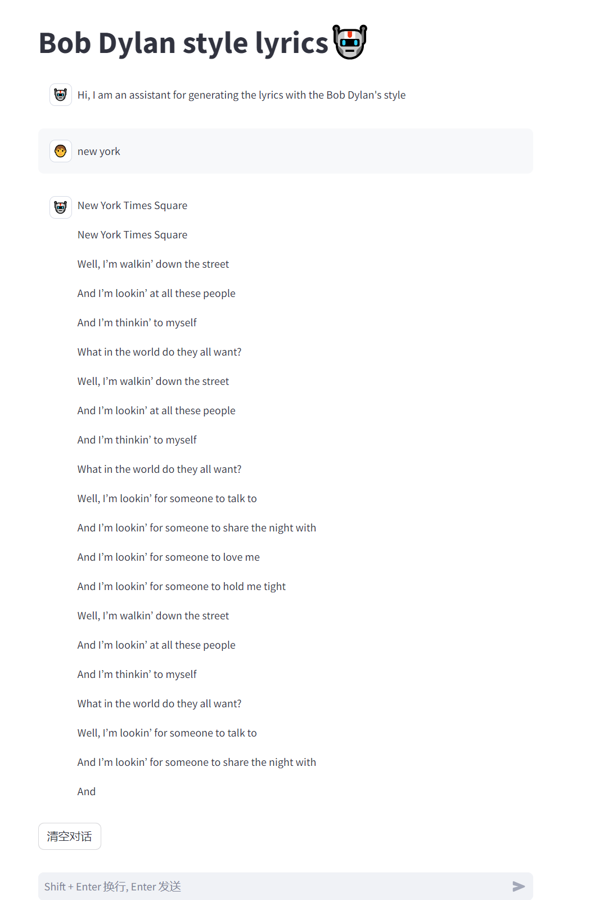

# Bob_Dylan_generator

## Purpose
Our project aims to collect the poem data of Bob Dylan from kaggle(https://www.kaggle.com/code/cloudy17/bob-dylan-songs-1961-2020/input) and fine-tune multiple LLMs models to enable them to generate poems in a style similar to Bob Dylan's. In addition to this, we have also implemented RAG (Retrieval-Augmented Generation) and evaluated and compared the outputs of these models. What's more, we provide a website user interface for testing.


## Features
- Collected a comprehensive dataset of Bob Dylan's poetry and song lyrics from various authenticated sources.
- Fine-tuned multiple Large Language Models (LLMs) to capture the essence of Bob Dylan's lyrical and poetic style.
- Implemented Retrieval-Augmented Generation (RAG) to enhance the creative output of the models by leveraging a database of Dylan's works.
- Developed a user-friendly graphical user interface (GUI) that allows users to input prompts and receive poetry generated in Bob Dylan's style. In addition, user can choose which model they want to use.
- Supported the generation of content in various formats, including song lyrics, short poems, and long-form poetry, to cater to diverse user preferences.
- Provided extensive documentation and codebase for the models' training and fine-tuning processes, offering insights for enthusiasts and researchers interested in natural language generation and stylistic emulation.
- Conducted a thorough evaluation and comparison of model outputs using a third LLM model, ensuring the quality and authenticity of the generated content.
- Enabled community contributions by allowing users to submit their own Dylan-esque poetry, which further trains and refines the models.


## Prepare
### Environment Requirements
- Python 3.8+
- Required dependencies (see requirements.txt)

### Installation Steps
After you fork and git clone the project, You should do the following steps:
1. Prepare for the virtual environment `python -m venv venv`
2. Activate virtual environment.<br/> Windows:`venv\Scripts\activate`, MacOS or Linux:`source venv/bin/activate`
3. Install required packages `pip install -r requirements.txt`


### Model Train

#### 1. Machine Learning model - N-gram Model

The n-gram model is a type of language model that predicts the next word by statistically analyzing the frequency of sequences of n words (i.e., n-grams) in the text. For example, a 2-gram (or bigram) model would consider sequences of every two words, while a 3-gram (or trigram) model would consider sequences of every three words. The steps is summarized below:

1. **Data Loading and Processing**: Through the `load_data` method, poetry data is loaded from a specified CSV file, containing the titles and lyrics of the songs. The loaded data is stored in a Pandas DataFrame for easy subsequent processing.

2. **Text Tokenization**: In the `tokensize` method, all lyrics are first combined into a long string, then tokenized into a list of words using the `nltk` `word_tokenize` method. This step converts the text into a sequence of words that can be further analyzed.

3. **Removing Stop Words and Non-alphabetic Characters**: The project further processes the tokenized words, removing English stop words and non-alphabetic characters to reduce noise and focus on content words. This is achieved by checking if each token is alphabetic and not in the list of stop words.

4. **Generating Bigrams**: Using the `generate_bigrams` method, the cleaned word sequence is converted into bigrams (word pairs), providing the model with the ability to consider the adjacent relationships between words. At the same time, the frequency distribution of bigrams is calculated and stored, which is very useful for understanding the relationships between words and generating text.

5. **Text Generation**: The `generate_text` method starts by randomly selecting a bigram as the starting point. Then, based on the second word of the current bigram, it finds all possible subsequent words and randomly selects one as the next word, and so on, generating a sequence of words. This method can generate text sequences that appear relatively coherent in grammar and semantics, although the generated text may have some randomness and uncertainty.


**N-gram Model result**

>see way well pressing yes believe man comes man peace information name give back town cold frosty morn creeps avoidin southside best soon lost race goes babylon girl france invited house fire peered darkness away kicked neighborhood bully fall well already gone spirit maker heartbreaker backbreaker leave know sun strong monkey log

#### 2. Deep Learning Approach Using Retrieval-Augmented Generation (RAG)

RAG refers to the process that optimize the output of a large language model by feeding the model with an extra dataset that the original model hasn't seen before.

1. **Pipeline**: 
- Extract the data from csv file in the following format: "title: lyrics" 
- Chunk the data using OpenAI Embedding model
- Store the embedded vectors in vector databse (Pinecone)
- Extract the vectors and perform a retrieval using semantic search (use cosine similarity as metric)
- Insert relevant context into LLM model
- Generate the response using RAG and without using RAG

2. **Result & Conclusion**:
The model's performance doesn't increase a lot using RAG when asking ChatGPT-4 which output sounds more likely to be in Bob Dylan's style. This probabaly because our base model has already beed trained on our provided dataset, thus RAG is not an ideal solution for our problem.


#### 3. Fine tune OpenAI gpt 3.5 turbo

1. **Data loading**: Load the Bob Dylan Poems dataset from json files under ```data\```. Data is in the format of :
```
{
    "messages": [
        {"role": "system", "content": system_prompt},
        {"role": "user", "content": user_prompt},
        {"role": "assistant", "content": lyrics}
        ]
}
```

2. **Fine tuning approach**: We fine tuned the gpt 3.5 model through the official OpenAI fine-tuning tutorial by calling ```client.fine_tuning.jobs.create``` method.

3. **Result**: Responses were then generated on ten poems topics, results are saved in ```output\poems_finetuned_gpt35.json```


#### 4. Fine tune Meta Llama-2-7b-chat

1. **Data loading**: Load the Bob Dylan Poems dataset from json files under ```data\```. Data is in the format of :
```
{
    "messages": [
        {"role": "system", "content": system_prompt},
        {"role": "user", "content": user_prompt},
        {"role": "assistant", "content": lyrics}
        ]
}
```


2. **Fine tuning approach**: We fine tuned the [meta/llama-2-7b-chat](https://huggingface.co/meta-llama/Llama-2-7b-chat-hf) model using the Hugging Face Transformers library. We use Q-LoRa to accelerate the fine-tuning process. By using this strategy, we are able to fine tune some layers of the model and output a model adapter. The adapter is then merged with the basemodel (llama2) for inference usage. Hugging face's ```SFTTrainer``` integrate well with Q-LoRa, which makes the fine-tuning process easier. Here are the hyperparameters we used for fine-tuning:
```
    args = TrainingArguments(
        output_dir="llama-7b-bobdylan",         # saving dir name, on hugging face hub
        num_train_epochs=3,                     # num of epochs
        per_device_train_batch_size=2,          
        gradient_accumulation_steps=2,          
        gradient_checkpointing=True,           
        optim="adamw_torch_fused",              
        logging_steps=10,                       # log every 10 steps
        save_strategy="epoch",                  
        learning_rate=2e-4,                     
        bf16=False,                              
        tf32=False,                              
        max_grad_norm=0.3,                      
        warmup_ratio=0.03,                      
        lr_scheduler_type="constant",           
        push_to_hub=True,                       # push the model to the hugging face hub
        report_to="tensorboard",                
    )
```

```
    peft_config = LoraConfig(
        lora_alpha=128,
        lora_dropout=0.05,
        r=256,
        bias="none",
        target_modules="all-linear",
        task_type="CAUSAL_LM",
    )
```

3. **Results**: Responses were then generated on ten poems topics, results are saved in ```poems_finetuned_llama2.json```


### Model Evaluation

We chose ChatGPT-4 as our third-party model to judge which output is closer to Bob Dylan's poetry style for 50 sleceted topics. We called the GPT-4 API and set an appropriate instruct prompt, using the generated poems from the two models to be compared as inputs. Then, we tallied the assessment results from GPT-4.

#### Model Comparison
Here's the result after we compare the five model's output using GPT-4

## Inference

### Hardware
- AWS g5.2xlarge
- Nvidia A100 GPU 

### Web interface
We built the project with streamlit, langchain and Huggingface libraries. Also, we deploy our model on AWS to support the user requests.




